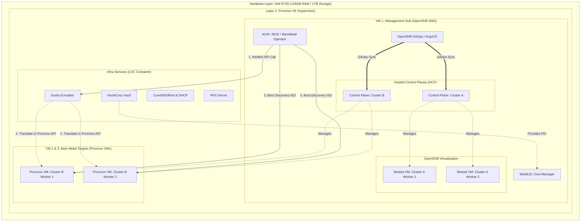

# Architecture Document: Enterprise OpenShift Platform Homelab

## 1. Executive Summary
This document outlines the architecture for a single-node hypervisor homelab designed to replicate an enterprise-grade OpenShift Platform Engineering environment. It specifically caters to learning Multi-cluster Management (ACM/MCE), GitOps orchestration, and HyperShift (Hosted Control Planes) across two distinct infrastructure providers: **OpenShift Virtualization (KubeVirt)** and **Bare Metal (BMO/Agent)**.

## 2. Architecture Diagram

You can view this diagram in any Markdown viewer that supports Mermaid (like GitHub, GitLab, or Obsidian), or paste it into [Mermaid Live Editor](https://mermaid.live/).

---

## 3. Resource Allocation Strategy

Given the strict constraint of **128GB RAM and 1TB Storage**, precise allocation is required. Overcommitting storage (Thin Provisioning) and relying on Proxmox KSM (Kernel Samepage Merging) for RAM will be necessary.

| Component | CPU | RAM Allocated | Storage Allocated | Role / Notes |
| :--- | :--- | :--- | :--- | :--- |
| **Proxmox Host** | 4 Cores | 4 GB | 60 GB | Base OS and Hypervisor operations. |
| **Infra Node (LXC)** | 2 Cores | 2 GB | 40 GB | Lightweight container for Vault, DNS, DHCP, NFS, and Sushy-Emulator. |
| **Mgmt Hub (SNO)** | 12 Cores | 78 GB | 400 GB | Runs SNO, ACM, MCE, GitOps, and KubeVirt. Must have **Nested Virtualization** enabled. |
| **Cluster A Workers** | *From Hub* | *(32 GB)* | *(200 GB)* | 2x 16GB KubeVirt VMs running *inside* the Hub VM. Consume Hub resources. |
| **Cluster B Worker 1** | 4 Cores | 22 GB | 120 GB | Empty Proxmox VM. Act as BMH target for Agent install. |
| **Cluster B Worker 2** | 4 Cores | 22 GB | 120 GB | Empty Proxmox VM. Act as BMH target for Agent install. |
| **Total Allocation** | **22 Cores** | **128 GB** | **740 GB** | Leaves ~260GB free for ISOs, snapshots, and overhead. |

---

## 4. Subsystem Design

### 4.1. Core Infrastructure & Networking
*   **Proxmox Networking:** Configured with two Linux Bridges.
    *   `vmbr0` (Management Network): Hosts the Hub IP, Proxmox UI, Infra LXC, and the primary NICs for the Bare Metal VMs.
    *   `vmbr1` (Tenant / Data Network): A VLAN-aware bridge mapped to Multus and NodeNetworkConfigurationPolicies for tenant workloads.
*   **Load Balancing:** MetalLB deployed on the Hub SNO in L2 mode to provide API and Ingress Virtual IPs (VIPs) for the Hosted Clusters.
*   **PKI / Secrets:** HashiCorp Vault (running in the LXC) acts as the Root CA. Cert-Manager on the Hub requests certificates via the Vault issuer for API and Ingress endpoints.

### 4.2. Storage Architecture
Because OpenShift Data Foundation (ODF) requires too much RAM, storage is handled via two lightweight mechanisms:
*   **LVMS (LVM Storage Operator):** Installed on the Hub SNO. A secondary 300GB virtual disk is attached to the SNO VM. LVMS turns this into a dynamic StorageClass. This is strictly used by OpenShift Virtualization to back the virtual hard drives of Cluster A's workers.
*   **NFS Provisioner:** An NFS server running in the Proxmox LXC, integrated into OpenShift via the `nfs-subdir-external-provisioner`. Used for general-purpose RWO/RWX persistent volumes (e.g., Vault backend, ArgoCD state).

### 4.3. The Management Hub (OpenShift SNO)
The central nervous system of the platform. It does not run tenant workloads. It runs:
*   **OpenShift GitOps:** Synchronizes configurations (mapping to `OcpMgmtClusterConfig`).
*   **ACM & MCE:** Provides the policy engine, multi-cluster dashboard, and HyperShift operator.
*   **Hosted Control Planes:** Runs the API servers, etcd, and controller managers for Cluster A and Cluster B as containerized Pods.

---

## 5. Provisioning Workflows

This architecture specifically supports two disparate provisioning mechanisms driven from a single management plane.

### Workflow A: The "Nested" KubeVirt Cluster
*Tracks back to your `it-ops-vm-prescription` repo knowledge.*
1.  **Trigger:** A `HostedCluster` and `NodePool` YAML is applied via ArgoCD, specifying `platform.type: KubeVirt`.
2.  **Execution:** HyperShift communicates with the local OpenShift Virtualization API on the Hub.
3.  **Instantiation:** KubeVirt provisions VirtualMachine (VM) resources utilizing the LVMS StorageClass.
4.  **Join:** The VMs boot Red Hat Enterprise Linux CoreOS (RHCOS) directly within the SNO and join Cluster A's Hosted Control Plane.

### Workflow B: The "Bare Metal" Proxmox Cluster
*Tracks back to your `OpenshiftACMPolicies` and BareMetal Operator knowledge.*
1.  **Preparation:** Two empty VMs are created natively in Proxmox with known MAC addresses.
2.  **BMC Emulation:** The `sushy-emulator` container in the Infra LXC is configured to authenticate with the Proxmox API.
3.  **Trigger:** `BareMetalHost` (BMH), `InfraEnv`, and `HostedCluster` (platform: Agent) CRDs are applied via GitOps.
4.  **Execution:** BMO reaches out to the Sushy-Emulator via Redfish API. Sushy translates this into a Proxmox API command to power cycle the VMs.
5.  **Provisioning:** BMO injects the Agent Discovery ISO via Virtual Media (emulated). The Proxmox VMs boot the ISO, register with MCE, receive their Ignition configs, write RHCOS to their disks, and join Cluster B.

---

## 6. GitOps & Policy Governance Flow
Once both clusters are provisioned, Day-2 operations map directly to your enterprise workflows:
1.  **App-of-Apps:** ArgoCD targets the local Management cluster to deploy global tools (Cert-Manager, MetalLB).
2.  **Cluster Sets:** Cluster A and Cluster B are automatically imported into ACM as managed clusters and added to a `ManagedClusterSet`.
3.  **Policy Placement:** ACM Policies (mapping to your `OpenshiftACMPolicies` repo) use `PlacementRules` to distribute RBAC, Vault integrations, and network configurations down to Cluster A and Cluster B.

## 7. Known Compromises & Limitations
*   **High Availability:** Hub and Spoke control planes operate in single-replica mode (`SingleReplica` topology) to conserve memory.
*   **Disconnected Environment:** Skipped. Images are pulled directly from public Red Hat / Quay registries to avoid the storage and RAM overhead of a mirror registry.
*   **Storage Redundancy:** No Ceph/ODF is used. Storage relies on Proxmox's underlying disk reliability.