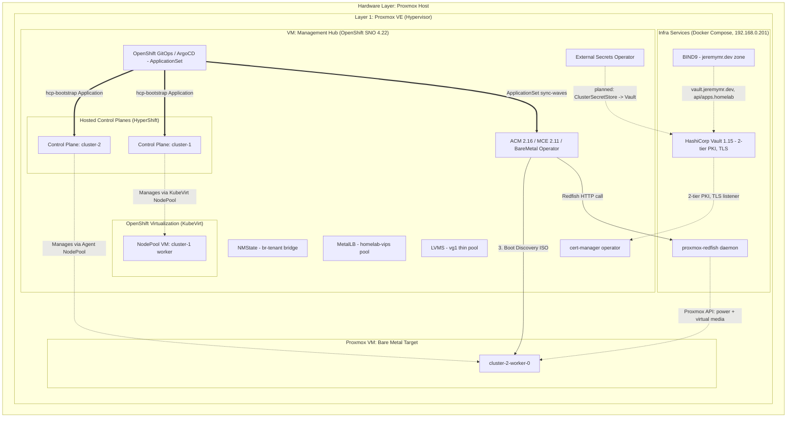

# Architecture Document: Enterprise OpenShift Platform Homelab

## 1. Executive Summary
This document outlines the architecture for a single-node hypervisor homelab designed to replicate an enterprise-grade OpenShift Platform Engineering environment. It specifically caters to learning Multi-cluster Management (ACM/MCE), GitOps orchestration, and HyperShift (Hosted Control Planes) across two distinct infrastructure providers: **OpenShift Virtualization (KubeVirt)** for `cluster-1` and **Bare Metal (BMO/Agent)** for `cluster-2`. The hub runs OpenShift 4.22 with RHACM 2.16/MCE 2.11.

## 2. Architecture Diagram

You can view this diagram in any Markdown viewer that supports Mermaid (like GitHub, GitLab, or Obsidian), or paste it into [Mermaid Live Editor](https://mermaid.live/).

---

## 3. Resource Allocation Strategy

Resource figures below reflect the values actually committed in the Helm charts (`operators/charts/managed-cluster/values/`), not a fixed hardware budget. Nested `cluster-1` compute comes out of whatever the Hub SNO VM is sized to; `cluster-2` compute is a separate Proxmox VM.

| Component | CPU | RAM | Storage | Role / Notes |
| :--- | :--- | :--- | :--- | :--- |
| **Mgmt Hub (SNO)** | Sized in Proxmox (not yet templated in Terraform) | Sized in Proxmox | Dedicated data disk for LVMS (`devicePath` is a `REPLACE_ME` placeholder) | Runs SNO, ACM/MCE, GitOps, cert-manager, External Secrets, NMState, MetalLB, LVMS, and OpenShift Virtualization. Requires **Nested Virtualization** enabled. |
| **cluster-1 NodePool** (KubeVirt) | 4 cores | 16 Gi | 120 Gi persistent, `lvms-vg1` StorageClass | `nodePool.replicas: 1` today. Comment in `gitops_bootstrap.md` says to raise to `2` once the hub is validated. |
| **cluster-2 worker** (`cluster-2-worker-0`) | Whatever the Proxmox VM is sized to | — | — | Only **one** `BareMetalHost` is currently defined in `values/cluster-2.yaml`. Boots via Redfish virtual media against `proxmox-redfish`. |
| **Infra services host** | — | — | — | Runs `bind9`, `vault`, and `proxmox-redfish` as Docker Compose services on `192.168.0.201`. |

**Note:** `Terraform/main.tf` and `outputs.tf` are currently empty — VM provisioning for the Hub and bare-metal targets is scaffolded (`providers.tf`, `variables.tf`, `terraform.tfvars`) but not yet implemented, so there's no authoritative CPU/RAM/disk sizing for the Hub or `cluster-2` VM to record here yet.

---

## 4. Subsystem Design

### 4.1. Core Infrastructure & Networking
*   **DNS:** BIND9 (Docker container `bind-dns`) is authoritative for the `jeremymr.dev` zone (`infra/bind/config/home.lan.zone`, `$ORIGIN jeremymr.dev.`). Records: `ns1` and `vault` → `192.168.0.201`; `api.homelab` and `api-int.homelab` → `192.168.0.135`; `*.apps.homelab` → `192.168.0.135`. Recursive queries are restricted to the internal `192.168.0.0/24` ACL and forwarded to `1.1.1.1`/`1.0.0.1`.
    *   **Known gap:** the committed `HostedCluster` values (`cluster-1.yaml`, `cluster-2.yaml`) still set `baseDomain: home.lan`, which doesn't match the `jeremymr.dev` zone actually being served. This needs to be reconciled (likely to `homelab.jeremymr.dev`) before a real cluster install.
*   **Tenant networking:** An `NodeNetworkConfigurationPolicy` (via the `nmstate` chart) creates a `br-tenant` Linux bridge on the Hub, uplinked through `ens19` — the SNO's second NIC, expected to be attached to Proxmox `vmbr1`.
*   **Load Balancing:** MetalLB operator, address pool `homelab-vips` = `192.168.0.230–192.168.0.250`, advertised via L2Advertisement. This range must be reserved outside DHCP.
*   **PKI / Secrets:** HashiCorp Vault 1.15 (Docker container, `192.168.0.201:8200/8201`) runs a two-tier PKI hierarchy — `pki_root` (root CA, 10-year max TTL) issuing to `pki_int` (intermediate, 5-year max TTL) — documented step-by-step in `docs/vault_pki_setup.md`. This was necessary because `.dev` is on the HSTS preload list, so plain HTTP to Vault's own UI isn't possible. Vault's own listener is TLS-terminated using a cert issued from its own intermediate (`fullchain.pem` + `vault.jeremymr.dev.key`), trusted manually today via a browser-imported root CA.
    *   The **cert-manager operator** is installed on the Hub (wave 50) but no `ClusterIssuer` wiring it to Vault exists yet in-repo.
    *   The **External Secrets Operator** is installed on the Hub (wave 60, via `ExternalSecretsConfig`) as the intended path to pull hosted-cluster pull-secrets/SSH keys/BMC credentials from Vault, but no `SecretStore`/`ClusterSecretStore` pointing at Vault is templated yet — `gitops_bootstrap.md` still has you create those secrets manually and calls out ExternalSecrets as a later replacement once the Vault auth path is validated.

### 4.2. Storage Architecture
No NFS provisioner and no ODF/Ceph are used.
*   **LVMS (LVM Storage Operator):** `LVMCluster` named `lvmcluster`, device class `vg1`, thin pool `thin-pool-1` (90% of the pool, 10x overprovision ratio). `deviceSelector.paths` requires a stable `/dev/disk/by-id/...` path to a dedicated, empty data disk on the SNO — currently a `REPLACE_ME` placeholder in `values/mgmt.yaml`. This backs the `lvms-vg1` StorageClass used by `cluster-1`'s KubeVirt NodePool root volumes.
*   **CloudNativePG:** `operators/values/hub.yaml` already lists a `cnpg` entry in the ApplicationSet generator (namespace `cnpg-system`, wave `10`), and `docs/gitops_bootstrap.md` describes the root Application as installing it — but **the `operators/charts/cnpg` chart directory doesn't exist yet**. This is a real gap between the documented/intended state and what's committed; the ApplicationSet will fail to render/sync this entry until the chart is added. (Also note: `cnpg`'s wave `10` currently collides with `lvm-storage`'s wave `10`.)

### 4.3. The Management Hub (OpenShift SNO)
Does not run tenant workloads. Per `operators/values/hub.yaml`, the root `ApplicationSet` (`hub-platform`, in the `homelab-platform` AppProject) renders one Argo CD Application per operator, gated by `argocd.argoproj.io/sync-wave`:

| Wave | Operator/Chart | Namespace |
| :--- | :--- | :--- |
| -10 | `gitops-operator` | `openshift-gitops-operator` |
| 0 | `acm-operator` (RHACM 2.16 / MCE) | `open-cluster-management` |
| 10 | `lvm-storage` | `openshift-lvm-storage` |
| 10 | `cnpg` *(chart missing — see 4.2)* | `cnpg-system` |
| 20 | `openshift-virtualization` (CNV) | `openshift-cnv` |
| 30 | `nmstate` | `openshift-nmstate` |
| 40 | `metallb` | `metallb-system` |
| 50 | `cert-manager` | `cert-manager-operator` |
| 60 | `external-secrets` | `external-secrets-operator` |

`MultiClusterHub` is created with `availabilityConfig: Basic`. Hosted-cluster Applications are deliberately **excluded** from this root ApplicationSet — they're bootstrapped separately by the `hcp-bootstrap` chart (see 4.4) once the hub prerequisites above are confirmed healthy.

### 4.4. Hosted Cluster Bootstrap
The `hcp-bootstrap` chart renders one Argo CD Application (sync-wave `40`) per entry in its `hostedClusters` list, each pointing at `operators/charts/managed-cluster` with a cluster-specific values file:
*   `cluster-1.yaml` → `platform.type: KubeVirt`
*   `cluster-2.yaml` → `platform.type: Agent`

Both clusters currently run `SingleReplica` control-plane and infrastructure availability, `OVNKubernetes` networking, and expose `APIServer` via `LoadBalancer` (MetalLB), `OAuthServer`/`Konnectivity` via `Route`.

---

## 5. Provisioning Workflows

### Workflow A: The "Nested" KubeVirt Cluster (`cluster-1`)
1.  **Trigger:** The `hcp-bootstrap` Application applies `HostedCluster`/`NodePool` manifests from `values/cluster-1.yaml`, with `platform.type: KubeVirt` and `baseDomainPassthrough: true`.
2.  **Execution:** HyperShift talks to the Hub's local OpenShift Virtualization (KubeVirt) API.
3.  **Instantiation:** KubeVirt provisions a `VirtualMachine` per NodePool replica (currently 1), using a 120 Gi persistent root volume on the `lvms-vg1` StorageClass.
4.  **Join:** The VM boots RHCOS inside the SNO and joins `cluster-1`'s Hosted Control Plane.

### Workflow B: The "Bare Metal" Proxmox Cluster (`cluster-2`)
1.  **Preparation:** A Proxmox VM (`cluster-2-worker-0`) is created with a known MAC address and left empty (no OS installed) to serve as a BMH target.
2.  **BMC Emulation:** BMC calls go to the **`proxmox-redfish`** daemon (`infra/docker-compose.yml`), *not* `sushy-tools` — the in-repo comments note sushy-tools cannot talk to the Proxmox API at all. `proxmox-redfish` exposes a Redfish endpoint on port `8000` and maps a Redfish "System" to a VM strictly by numeric Proxmox VMID (the last path segment of the BMC address).
3.  **Trigger:** `BareMetalHost`, `InfraEnv`, and `HostedCluster` (`platform: Agent`) manifests are applied via the `managed-cluster` chart. The BMH's `bmc.address` follows `redfish-virtualmedia://<proxmox-redfish-host>:8000/redfish/v1/Systems/<vmid>`.
4.  **Execution:** Metal3's BareMetal Operator calls the `proxmox-redfish` daemon's Redfish API (Basic Auth — this can be a Proxmox API token in `user@realm!token-name` / token-secret form, validated separately from the daemon's own Proxmox session credentials). The daemon translates this into real Proxmox power and virtual-media API calls.
5.  **Provisioning:** BMO injects the Agent discovery ISO via emulated virtual media. The VM boots the ISO, registers with MCE/Assisted Installer, receives its Ignition config, writes RHCOS to `/dev/vda`, and joins `cluster-2`'s Hosted Control Plane.

---

## 6. GitOps & Policy Governance Flow
1.  **Bootstrap order:** OpenShift GitOps (Operator) is installed once manually via OLM Subscription; everything after that — including the `gitops-operator` chart itself — is reconciled continuously by the root `hub-platform` Application (`operators/`, `values/hub.yaml`).
2.  **Cluster import:** `cluster-1` and `cluster-2` are imported into ACM as managed clusters. Only clusters manually labeled `homelab.openshift.io/managed=true` are targeted by policy — this label is **not** applied automatically and must be set after each `HostedCluster` is imported.
3.  **Policy Placement:** `acm-policies` (a Helm chart, not raw `PlacementRule`s) defines a single `Placement` (`hosted-clusters`) and one `Policy` named `baseline-cluster-configuration`, currently in `remediationAction: inform`. It enforces a `platform-baseline` namespace (with the managed label) and, if enabled, a default `LimitRange` (`50m` CPU / `64Mi` memory requests). This is a starting baseline, not yet the full RBAC/Vault/network policy set described in earlier drafts of this document.

---

## 7. Known Compromises, Gaps & Limitations
*   **High Availability:** Hub and both hosted clusters run `SingleReplica` topology to conserve resources.
*   **Disconnected Environment:** Skipped — images pull directly from Red Hat/Quay registries; no mirror registry.
*   **Storage Redundancy:** No Ceph/ODF; storage relies on the underlying Proxmox disk(s) via LVMS.
*   **Terraform is scaffolded, not wired up:** `main.tf` and `outputs.tf` are empty. VM creation for the Hub and bare-metal targets isn't yet automated.
*   **`cnpg` chart is referenced but not committed** (`operators/values/hub.yaml` expects `operators/charts/cnpg` to exist).
*   **`baseDomain: home.lan`** in both hosted-cluster values files doesn't match the DNS zone actually served (`jeremymr.dev`) — needs reconciling before real installs.
*   **Vault ↔ cert-manager / External Secrets wiring is not yet templated.** Both operators are installed on the Hub, but no `ClusterIssuer` or `ClusterSecretStore` connecting them to Vault exists in-repo yet; secrets are still created manually per `docs/gitops_bootstrap.md`.
*   **`cluster-2` currently defines only one bare-metal worker** (`cluster-2-worker-0`); a second BMH entry would be needed to match `cluster-1`'s eventual 2-replica target.
*   **Remaining `REPLACE_ME` placeholders:** `repoURL` in `acm-operator/values/mgmt.yaml` and `hcp-bootstrap/values/mgmt.yaml` (still point at `github.com/REPLACE_ME/openshift-lab.git` even though `operators/values/hub.yaml` has the real repo URL), BMC credentials/MAC address in `cluster-2.yaml`, LVMS `devicePath`, and SSH/pull-secret values throughout.
